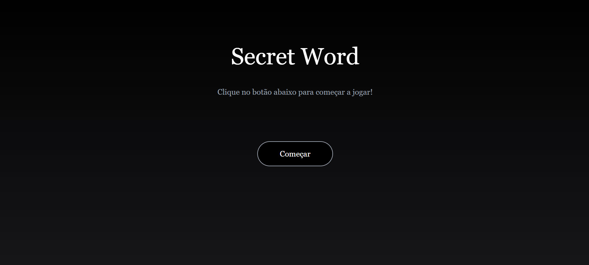

<h1 align="center">
    
</h1>

<h4 align="center"> 
     Site Concluído!! 	
</h4>

 <a href="#-sobre-o-projeto">Sobre</a> •
 <a href="#-funcionalidades">Funcionalidades</a> •
 <a href="#-layout">Layout</a> • 
 <a href="#-como-executar-o-projeto">Como executar o site</a> • 
 <a href="#-tecnologias">Tecnologias</a> • 
 <a href="#-autor">Autor</a> • 
 <a href="#user-content--licença">Licença</a>

## 💻 Sobre o projeto

Secret Word - é um projeto todo desenvolvido em React Js para mostrar meus conhecimentos.
Ele é um game no estilo caça palavras em que o player tem 5 chances para ir adivinhando as letras da palavra secreta até completala, o player tem acesso a uma dica sobre a palavra.
O game também mostras as letras que o Player for errando.
A cada palavra acertada o player ganha 100 pontos.

No final do jogo o player tem o total de pontos obtidos em score e a opção de inicar uma nova partida

---

- [x] botão de start game
- [x] mostrar pontuação
- [x] mostar letras erradas
- [x] 5 chances de acertar uma letra
- [x] dica sobre a palavra
- [x] Roda apenas em pc/notebook
- [x] botão de reiniar partida

### Mobile

Ainda em Desenvolvimento

---

### Web

  

  

  

---

## 🚀 Como executar o projeto/site

basta acessar o o link
[Secret Word](https://jogo-secret-words.vercel.app/)

---

## 🛠 Tecnologias

As seguintes ferramentas foram usadas na construção do projeto:

#### **Website**/ ([Html](https://devdocs.io/html//) + [Tailwindcss](https://tailwindcss.com/) + [Js](https://devdocs.io/javascript) + [ReactJs](https://pt-br.reactjs.org/docs/cdn-links.html))

---

## 🦸 Autor

 
<a href="https://github.com/DeyvisonTav">
 
  
  
 <b>Deyvison Tavares</b>🚀</a>
  
  

---

## 📝 Licença

Este projeto esta sobe a licença [MIT](./LICENSE).

Feito com ❤️ por Deyvison Tavares 👋🏽 [Entre em contato!](https://www.linkedin.com/in/deyvison-tavares/)
